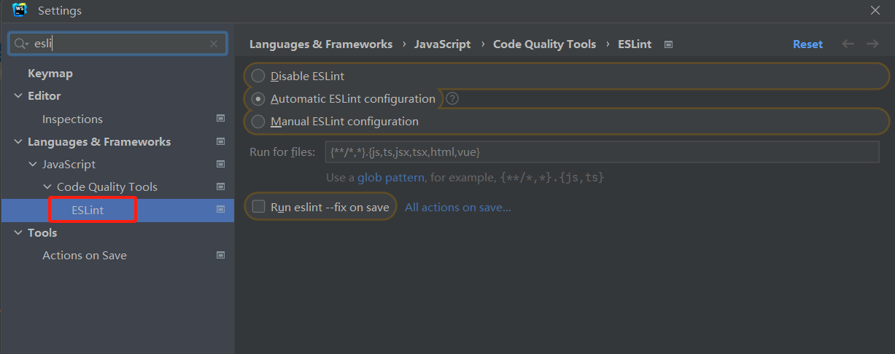

[TOC]


# 实战：智能 OJ (在线判题系统)

## 判题系统相关概念

## 架构设计

## 核心业务流程

## 表结构设计

> 若是对相关表需要有哪些字段不是很了解，可以参考市面上已有的系统来进行表结构的设计，或者也可使用 al 工具进行设计

### 一、题目表

- 题目标题：title

- 题目内容：content

- 题目标签：tags

  - 例如：难易度标签、题目属于哪一类数据结构的标签等
  - 使用 json 数组字符串进行存储，即将 json 数组转化为字符串存储在数据库

- 题目标准答案：answer

- 题目提交数：submitNum

- 题目通过数：acceptedNum

- 判题用例：judgeCase

  ```json
  {
  	input:"1 2",
  	output:"3 4"
  },
  {
  	input:"1 2",
  	output:"3 4"
  }
  ```

- 判题配置：judgeConfig

  - timeLimit：时间限制（ms）
  - memoryLimit：内存限制（kb）
- stackLimit：堆栈限制
  
  ```
  {
  	timeLimit:"1",
  	memoryLimit:"3",
  	stackLimit:"1"
  }
  ```

```sql
-- 题目表
create table if not exists question
(
    id              bigint auto_increment comment 'id' primary key,
    title           varchar(512)                       null comment '题目标题',
    content         text                               null comment '题目内容',
    tags            varchar(1024)                      null comment '题目标签列表（json 数组）',
    answer          text                               null comment '题目答案',
    submitNum       int      default 0                 not null comment '题目提交数',
    acceptedNum     int      default 0                 not null comment '题目通过数',
    judgeCase       text                               null comment '判题用例',
    judgeConfig     text                               null comment '判题配置',
    thumbNum        int      default 0                 not null comment '点赞数',
    favourNum       int      default 0                 not null comment '收藏数',
    creatorId       bigint                             not null comment '创建用户 id',
    createTime      datetime default CURRENT_TIMESTAMP not null comment '创建时间',
    updateTime      datetime default CURRENT_TIMESTAMP not null on update CURRENT_TIMESTAMP comment '更新时间',
    isDelete        tinyint  default 0                 not null comment '是否删除',
    index idx_creatorId (creatorId)
) comment '题目' collate = utf8mb4_unicode_ci;
```

### 二、题目提交表

> 用户提交的题目的资料

- 用户 id ：userId

- 题目 id：questionId

- 提交的编程语言：language

- 提交的代码：code 

- 题目提交后的判题状态：status

- 判题信息：judgeInfo

  ```json
  {
  	"message":"题目执行信息",
  	"time":"执行所花费的时间（ms）",
  	"memory":"执行所花费的内存（kb）"
  }
  ```

  > `message` 的枚举值
  >
  > - Accepted  成功
  > - Wrong Answer 答案错误
  > - Compile Error 编译错误
  > - memory limit exceeded 内存溢出
  > - time limit exceeded 超时
  > - presentation error 展示错误
  > - output limit exceeded 输出溢出
  > - waiting 等待中
  > - dangerous operation 危险操作
  > - runtime error 运行错误（用户程序运行出错）
  > - system error 系统错误（判题系统出错）

```sql
-- 题目提交表
create table if not exists question_submit
(
    id         bigint auto_increment comment 'id' primary key,
    questionId bigint                             not null comment '题目 id',
    language   varchar(256)                       not null comment '编程语言',
    code       text                               not null comment '提交代码',
    status     int      default 0                 not null comment '判题状态（0 - 待判题、1 - 判题中、2 - 成功、3 - 失败）',
    judgeInfo  text                               null comment '判题信息（存 json 字串）',
    userId     bigint                             not null comment '提交用户 id',
    createTime datetime default CURRENT_TIMESTAMP not null comment '创建时间',
    updateTime datetime default CURRENT_TIMESTAMP not null on update CURRENT_TIMESTAMP comment '更新时间',
    isDelete   tinyint  default 0                 not null comment '是否删除',
    index idx_questionId (questionId),
    index idx_userId (userId)
) comment '题目提交表';
```

### 三、什么情况下适合加索引，如何选择给那个字段加索引

> 首先从业务出发，无论是单个索引还是联合索引，都要从实际的业务查询语句、字段枚举值的区分度、字段的类型考虑（where 条件指定的字段）
>
> 原则上：
>
> - 能不用索引就不用索引
> - 能用单个索引就不用联合索引或多个索引
> - 不给区分度低的字段加索引（如：性别）
>
> 因为索引也是占用空间的


## 技术选型

- 前端
  - TypeScript
  - vueCli
  - arco.design
  - vuex
  - 在线代码编辑器组件
    - [*monaco*-editor](https://github.com/microsoft/monaco-editor)
  - 在线文档编辑浏览组件（富文本编辑）
    - [*bytemd*](https://github.com/bytedance/bytemd)
- 后端
  - java 进程控制
  - java 安全管理器
  - jvm 
- 其他
  - 虚拟机
  - docker
  - spring boot
  - spring cloud 微服务
  - 消息队列

## 项目初始化

### 一、 前端项目初始化

- node 版本：18.12.0
- npm 版本：9.5.1

- 安装 vue-cli 脚手架

  ```baash
  npm install -g @vue/cli 
  ```

  - @vue/cli 5.0.8 
    - typescript
    - eslint
    - prettier

- 创建 vue 项目

  ```bash
  vue create 项目名
  ```

- IDE：webstorm

  - 前端工程化配置

    - 代码美化

      

    - 语法校验

      

- 引入组件 

  - [arco.design]: https://arco.design/vue	"组件库"

  - 安装

    ```bash
    npm install --save-dev @arco-design/web-vue
    ```


#### 1. 前端通用布局

1. 创建 layouts 目录 ，创建 BasicLayout.vue 文件

   - 方便多个布局的切换

   - 此后内容可在 BasicLayout.vue 中编写

#### 2. 动态路由跳转

- 步骤

  1. 提取通用路由文件 （route.ts）

  2. 菜单文件读取路由

     > export 导出的对象在 import 时需要 {} 进行解构导入
     >
     > export default 导出则不需要

  3. 绑定菜单组件跳转事件

  4. 同步路由到菜单项

     > 点击菜单项 => 跳转更新路由 => 跳转路由后同步更新菜单项被选中状态

     ```typescript
     <script setup lang="ts">
     import { routes } from "../router/routes";
     import { useRouter } from "vue-router";
     import { ref } from "vue";
     
     //默认选中的菜单
     const selectedKeys = ref(["/"]);
     
     //点击菜单项进行路由跳转
     const router = useRouter();
     const clickMenuItem = (key: string) => {
       router.push({ path: key });
     };
     
     //路由跳转后更新菜单选中状态
     router.afterEach((to) => {
       selectedKeys.value = [to.path];
     });
     </script>
     ```

#### 3. 使用 VUEX 进行全局状态管理

- 像用户数据此类数据可用于全局管理

#### 4. 页面菜单路由跳转权限管理

- 路由中的 meta 属性可用于保存权限信息

- 在路由跳转之前验证用户是否可路由该页面

  ```typescript
  import { useRouter } from "vue-router";
  import { useStore } from "vuex";
  
  const store = useStore();
  const router = useRouter();
  router.beforeEach((to, from, next) => {
    if (
      to.meta.access === "adminAccess" &&
      store.state.user?.loginUserInfo?.role !== "admin"
    ) {
      next("/no-auth");
    }
    next();
  });
  ```


#### 5. 隐藏需要权限的路由菜单

> 在v-for 中不要使用 v-if 去筛选需要的数据，这样会先循环所有的数据再进行判断，导致性能浪费
>
> 解决方案：可以先在 js/ts 中过滤出需要数据再使用 v-for 渲染数据

```typescript
const visibleRoutes = routes.filter((item) => {
  return !item.meta?.hiddenInMenu;
});
```

```html
        <a-menu-item v-for="item in visibleRoutes" :key="item.path"
          >{{ item.name }}
        </a-menu-item>
```

#### 6. 根据检查用户权限和路由所需要的权限判断是否需要隐藏路由菜单

1. 编写全局的检查用户权限的函数

   ```typescript
   import PERMISSION_ENUM from "@/access/permissionEnum";
   
   /**
    * 全局检查用户权限函数（根据需要的权限判断用户是否有权限）
    * @param user 用户信息
    * @param needPermission 需要的权限
    * @return boolean
    */
   const checkPermission = (
     user: any,
     needPermission: string = PERMISSION_ENUM.NOT_LOGIN
   ) => {
     // 获取用户权限
     const userPermission = user?.userRole ?? PERMISSION_ENUM.NOT_LOGIN;
     // 用户未登录但是需要的是 user 权限
     if (
       needPermission === PERMISSION_ENUM.USER &&
       userPermission === PERMISSION_ENUM.NOT_LOGIN
     ) {
       return false;
     }
     // 用户需要的是 admin 权限，但是用户不是 admin
     if (
       needPermission === PERMISSION_ENUM.ADMIN &&
       userPermission !== PERMISSION_ENUM.ADMIN
     ) {
       return false;
     }
     return true;
   };
   
   export default checkPermission;
   
   ```

2. 判断用户是否有权限显示菜单

   ```typescript
   //用于获取store中的全局状态数据
   const store = useStore();
   const visibleRoutes = computed(() => {
     return routes.filter((item) => {
       //根据用户的权限判断是否隐藏菜单
       if (
         !checkPermission(
           store.state.user?.loginUserInfo,
           item.meta?.access as string
         )
       ) {
         return false;
       }
       //根据路由的meta属性判断是否隐藏该菜单
       return !item.meta?.hiddenInMenu;
     });
   });
   ```

   > 使用计算属性可以检查检测用户信息的更改，触发菜单栏的重新渲染，可显示更新后的用户所具有权限的菜单项

#### 7. 全局入口函数

- 在 App.vue 文件中添加全局入口函数

  - 全局只调用一次的函数可以在该函数中进行调用

    ```typescript
    /**
     * 全局初始化函数
     */
    const doInit = () => {
      console.log("kkoj 系统欢迎你！");
    };
    
    onMounted(() => {
      doInit();
    });
    ```

### 二、后端项目初始化

1. 导入后端模板，修改后端模板文件项目名称

2. idea 打开，使用以下快捷键修改相关包名和文件夹名

   > ctrl shift f  全局搜索
   >
   > ctrl shift r  全局替换
   >
   > shift f6 修改文件名

3. 修改 application.yml 文件中的 MySQL 配置信息，并在本地创建相关数据库和数据表

4. 运行项目

   > 运行时遇到的问题
   >
   > 链接数据库时 MySQL 密码正确，但是报错 Access denied for user 'root'@'localhost' (using password: YES)，使用idea 中的 database 工具可连接上，项目运行时就是无法连接
   >
   > 解决方案：重新修改了个新的 MySQL 的密码，就可以连接上了
   >
   > ```sql
   > ALTER USER 'root'@'localhost' IDENTIFIED WITH mysql_native_password BY 'new_password';
   > 
   > ALTER USER 'root'@'%' IDENTIFIED WITH mysql_native_password BY 'new_password';
   > ```

5. swagger 相关组件

   > Knife4j-OpenAPI2-UI 是 Knife4j 项目中针对 OpenAPI 2.0 规范提供的一款增强型 Swagger 文档 UI 界面。Knife4j（前身是 Swagger-bootstrap-ui）是一个由国内开发者开发的开源工具，用于改善和增强 Java Spring Boot 应用程序中集成 Swagger 后生成的 API 文档界面。
   >
   > ------------------------------------
   >
   > Knife4j-OpenAPI2-spring-boot-starter 是一个用于 Spring Boot 项目的自动化配置starter模块，它简化了在基于 Spring Boot 的应用中集成 Swagger 以支持 OpenAPI 2.0 规范的过程。通过引入这个 starter，开发者可以方便快捷地为项目启用和配置 Swagger2，并使用 Knife4j 提供的增强型文档界面。 

   

### 三、前后端联调

- 前端使用 axios 发送请求

  ```bash
  # 安装 axios
  npm install axios
  ```

  > 传统情况下，前端需要为每个后端接口单独编写一个 axios 请求
  >
  > 现在可以使用 openapi 工具自动根据接口文档生成所有请求
  >
  > [ferdikoomen/openapi-typescript-codegen: NodeJS library that generates Typescript or Javascript clients based on the OpenAPI specification (github.com)](https://github.com/ferdikoomen/openapi-typescript-codegen)、
  >
  > ```bash
  > # 安装该工具
  > npm install openapi-typescript-codegen --save-dev
  > 
  > #根据接口文档生成 axios 请求
  > openapi --input http://localhost:8101/api/v2/api-docs --output ./generated --client axios
  > ```
  >
  > -----------
  >
  > 使用 services 目录下的代码即可发送 axios 请求

- 若需要自定义请求参数（如：baseurl 等）

  1. 可在 OpenApi.ts 中修改

     ```typescript
     export const OpenAPI: OpenAPIConfig = {
       BASE: "http://localhost:8101",
       VERSION: "1.0",
       WITH_CREDENTIALS: false,
       CREDENTIALS: "include",
       TOKEN: undefined,
       USERNAME: undefined,
       PASSWORD: undefined,
       HEADERS: undefined,
       ENCODE_PATH: undefined,
     };
     ```

  2. 可在 axios 的拦截器中配置 axios 的属性

     [拦截器 | Axios中文文档 | Axios中文网 (axios-http.cn)](https://www.axios-http.cn/docs/interceptors)

## 功能开发

### 一、用户登录功能

1. 前端实现全局的用户登录和路由跳转时权限的检查

   - 针对上面前端项目初始化的第四点做的优化

   > 思路：提取出全局登录和路由权限检查的逻辑，在 App.vue 或者 main.ts 或一些全局组件中引用此逻辑即可
   >
   > ----
   >
   > access 目录下的 index.ts 文件
   >
   > ```typescript
   > import store from "@/store";
   > import router from "@/router";
   > import PERMISSION_ENUM from "@/access/permissionEnum";
   > import checkPermission from "@/access/checkPermission";
   > 
   > //在路由跳转前执行
   > router.beforeEach(async (to, from, next) => {
   >   //自动登录逻辑
   > 
   >   if (store.state.user?.loginUserInfo.userRole == null) {
   >     await store.dispatch("user/getUserInfo");
   >   }
   > 
   >   const userinfo = store.state.user?.loginUserInfo;
   >   const userRole = userinfo.userRole;
   > 
   >   const needPermission = to.meta?.access ?? PERMISSION_ENUM.NOT_LOGIN;
   >   //页面只需要未登录权限则直接跳转
   >   if (needPermission == PERMISSION_ENUM.NOT_LOGIN) {
   >     next();
   >     return;
   >   }
   > 
   >   //页面需要登录权限
   >   //用户未登录
   >   if (!userRole || userRole == PERMISSION_ENUM.NOT_LOGIN) {
   >     //跳转到登录页，登录成功重定向会原页面
   >     next(`user/login?redirect:${to.fullPath}`);
   >     return;
   >   }
   >   //用户已登陆，先检查权限
   >   if (!checkPermission(userinfo, needPermission as string)) {
   >     next("/no-auth");
   >     return;
   >   }
   >   next();
   > });
   > 
   > ```
   >
   > 在 main.ts中引入该文件
   >
   > ```typescript
   > import "./access/index";
   > ```

2. 多页面布局区分

   在 vue.app 中进行区分

   ```vue
   <template>
     <div id="app">
       <template v-if="route.path.startsWith('/user')">
         <router-view />
       </template>
       <template v-else>
         <BasicLayout />
       </template>
     </div>
   </template>
   ```

3. 提交表单实现登录功能

   ```typescript
   /**
    * 提交登录表单
    */
   const handleSubmit = async () => {
     const response = await UserControllerService.userLoginUsingPost(form);
     if (response.code == 0) {
       message.success("登录成功");
   
       //更新全局的用户信息
       store.dispatch("user/getUserInfo");
   
       //跳转至首页
       router.push({
         path: "/",
         replace: true, //不可通过点击浏览器回退按钮返回至该页面
       });
     } else {
       message.error("登录失败");
     }
   };
   ```

   > 注意：
   >
   > http 是无状态的，在发送请求时需要携带 cookie ，服务器通过检查 Cookie 来识别已登录用户并维持其会话状态。
   >
   > 因此前端在发起请求时也需要设置 WITH_CREDENTIALS: true，这样浏览器才会在跨域请求中携带 Cookie
   >
   > 使用 openapi 自动生成请求方式的在 OpenApi.ts 设置 WITH_CREDENTIALS: true
   >
   > ```typescript
   > export const OpenAPI: OpenAPIConfig = {
   >   BASE: "http://localhost:8101",
   >   VERSION: "1.0",
   >   WITH_CREDENTIALS: true,
   >   CREDENTIALS: "include",
   >   TOKEN: undefined,
   >   USERNAME: undefined,
   >   PASSWORD: undefined,
   >   HEADERS: undefined,
   >   ENCODE_PATH: undefined,
   > };
   > ```
   >

   > 不是所有情况下前端请求都需要携带后端返回的cookie。前端是否需要携带cookie取决于具体的业务场景和安全策略：
   >
   > - 同源请求：当前端应用与后端服务位于同一域名下时，浏览器会自动在后续请求中携带相应的cookie，无需显式配置。
   > - 跨域请求：
   >   如果跨域请求需要携带cookie，比如进行身份验证或维持状态等，则需要满足以下条件：
   >   1. 后端服务器必须通过CORS（Cross-Origin Resource Sharing）设置`Access-Control-Allow-Credentials: true`响应头，允许跨域请求包含凭据（如cookie）。
   >      前端在发起请求时需设置withCredentials: true属性，以便AJAX请求或其他HTTP客户端库能携带cookie到服务器。
   >   2. 如果跨域请求不需要携带用户认证相关的cookie信息，或者采用其他方式进行身份验证（例如Bearer Token、JWT等），则无需携带后端返回的cookie。
   >
   > 因此，是否需要携带cookie取决于后端API设计以及应用所采用的身份验证和授权机制。如果确实需要前端在请求中携带cookie，则按照上述跨域规则进行配置即可。否则，在很多现代Web应用中，尤其是在前后端分离架构中，往往倾向于使用无状态的令牌机制来代替传统的session管理方式。


### 二、crud 接口开发

后端接口开发的基本流程

> 1. 根据功能设计数据库表
> 2. 自动生成对数据库基本的增删改查（插件：mybatis X）
> 3. 编写 controller，实现基本的增删改查和权限校验
> 4. 根据业务开发定制化的功能

2. 使用 `mybatis X`插件生成相关的`mapper`和`service`

   

   
   
2. 将生成的代码移到对应的包下

3. 编写 controller、service 逻辑以及相关实体的 dto、vo、枚举值

   > DTO：
   >
   > - 用于封装数据传输对象，可以将数据库中的数据转换为前端需要的格式，方便前后端之间的数据交互。
   >
   > VO：
   >
   > - 用于封装值对象，可以根据具体的需求来封装不同的数据属性，方便前端页面的显示和交互。
   >
   > - 可以节约网路传输大小、或者过滤字段（脱敏）、保证安全性

   > 可以给 JSON 类型的字段编写单独的实体类，更方便处理该 json 字段中的内容 
   >
   > 枚举：例如编程语言、判题状态等

#### 查询题目提交信息需求

- 需求
  - 可以根据用户id、题目id进行查询
  - 用户本人仅能查看自己（提交用户 id与登录用户 id 不同）提交的代码
  - 管理员可以看到所有用户提交的代码

- 实现方案：先查询，再根据用户是否为本人进行脱敏

  ```java
      public QuestionSubmitVO getQuestionSubmitVO(QuestionSubmit questionSubmit, User loginUser) {
          QuestionSubmitVO questionSubmitVO = QuestionSubmitVO.objToVo(questionSubmit);
          //题目提交用户id
          Long userId = questionSubmit.getUserId();
          //除管理员外，用户本人仅能查看自己提交的代码
          if (!userId.equals(loginUser.getId()) && !userService.isAdmin(loginUser)) {
              questionSubmitVO.setCode(null);
          }
          return questionSubmitVO;
      }
  ```

### 三、前端页面开发

- 相关功能
  - 用户注册
  - 创建题目（管理员）
  - 题目管理（管理员）
    - 查看
      - 使用了 arco.design 组件库中的 table 组件
    - 删除
      - 删除后需要重新加载表格数据
    - 修改
      - 可复用创建题目页面，通过路由区分是修改还是创建
    - 创建
  - 题目列表（查看题目信息）
    - 使用了 arco.design 组件库 table 组件、form 组件、tags 组件等
  - 在线做题页面
  - 使用 bytemd 的 viewer 组件和 monaco-editor 组件
  - 题目提交列表（查看题目提交的信息）
  - 扩展
    - 统计相关功能
  
- 需要使用的组件

  - 整合 Markdown 富文本编辑器

    - [*bytemd*](https://github.com/bytedance/bytemd)

    - 安装

      ```bash
      npm i @bytemd/vue-next
      ```

    - main.ts 中引入

      ```ts
      import 'bytemd/dist/index.css'
      ```

    - 具体使用看官方文档

    - 子父组件属性传递，将属性和方法暴露给使用组件的地方，提高组件通用性

      ```tsx
      <template>
        <Editor :value="value" :plugins="plugins" @change="handleChange" />
      </template>
      
      <script setup lang="ts">
      import gfm from "@bytemd/plugin-gfm";
      import highlight from "@bytemd/plugin-highlight";
      import { Editor, Viewer } from "@bytemd/vue-next";
      import { withDefaults, defineProps } from "vue";
      
      interface Props {
        value: string;
        handleChange: (v: string) => void;
      }
      
      const props = withDefaults(defineProps<Props>(), {
        value: () => "",
        handleChange: (v: string) => {
          console.log(v);
        },
      });
      
      const plugins = [gfm(), highlight()];
      </script>
      ```

  - 整合代码编辑器

    - [*monaco*-editor](https://github.com/microsoft/monaco-editor)：微软官方编辑器

    - 安装

      ```bash
      npm install monaco-editor
      npm install monaco-editor-webpack-plugin
      ```

    - vue-cli 脚手架是基于 webpack 进行打包，可在 `vue.config.js` 文件中对 webpack 进行配置

      ```js
      const { defineConfig } = require("@vue/cli-service");
      const MonacoWebpackPlugin = require("monaco-editor-webpack-plugin");
      
      module.exports = defineConfig({
        transpileDependencies: true,
        configureWebpack: {
          plugins: [new MonacoWebpackPlugin()],
        },
        // chainWebpack: (config) => {
        //   config.plugin("monaco").use(new MonacoWebpackPlugin());
        // },
      });
      ```

    - 注意，monaco editor 在读写值的时候，要使用 `toRaw(编辑器实例)` 的语法来执行操作，否则会卡死

      ```ts
        // 改变编辑器内容
        toRaw(myEditor.value).setValue("");
      
        //监听编辑器内容变化
        myEditor.value.onDidChangeModelContent(() => {
          console.log(toRaw(myEditor.value).getValue());
        });
      ```

    - 子父组件属性传递，将属性和方法暴露给使用组件的地方，提高组件通用性

      ```ts
      <template>
        <div id="code-editor" ref="codeEditor" style="min-height: 400px"></div>
      </template>
      
      <script setup lang="ts">
      import * as monaco from "monaco-editor";
      import { defineProps, onMounted, ref, toRaw, withDefaults } from "vue";
      
      /**
       * 提供属性接口，交给父组件
       */
      interface Props {
        value: string;
        handleChange: (v: string) => void;
      }
      
      /**
       * 定义属性默认值
       */
      const props = withDefaults(defineProps<Props>(), {
        value: () => "",
        handleChange: (v: string) => {
          console.log(v);
        },
      });
      
      const value = ref(`function hello() {
      	alert('Hello world!');
      }`);
      const codeEditor = ref();
      const myEditor = ref();
      
      onMounted(() => {
        if (!codeEditor.value) {
          return;
        }
        myEditor.value = monaco.editor.create(codeEditor.value, {
          value: props.value,
          language: "java",
          automaticLayout: true,
          readOnly: false,
          minimap: {
            enabled: true,
          },
          theme: "vs-dark",
        });
        //监听编辑器内容变化
        myEditor.value.onDidChangeModelContent(() => {
          props.handleChange(toRaw(myEditor.value).getValue());
        });
      });
      </script>
      ```

    - 代码编辑器切换编程语言

      ```ts
      /**
       * 监听语言变化
       */
      watch(
        () => props.language,
        () => {
          if (myEditor.value) {
            monaco.editor.setModelLanguage(
              toRaw(myEditor.value).getModel(),
              props.language
            );
          }
        }
      );
      ```

      

### 四、判题机开发（判题服务 + 代码沙箱）

#### 代码沙箱实现方式

- 可实现的代码沙箱
  - 自定义实现代码沙箱
    - docker 实现
    - Java 原生实现
  - 调用第三方代码沙箱（别人的 api 接口）

####  判题服务开发

- 判题服务是在题目提交的时候进行调用
  - 在题目提交后调用判题服务，因此题目提交接口需要先往题目提交表里插入数据，然后再调用判题服务，判题服务通过对题目的传入输入、输出用例、代码、编程语言等信息进行处理，等待判题服务返回结果
  - 判题服务主要逻辑是把输入用例和代码传入代码沙箱，代码沙箱返回结果后，再验证输出用例等信息，以达到判题的目的。因此代码沙箱和判题服务是解耦的，代码沙箱只负责返回结构，无论结果错对
  - 使用策略模式，用于区分不同场景下不同的实现逻辑，例如：编程语言不同，判题的逻辑会不一样，需要校验的数据不同等

#### 代码沙箱开发

- 由于代码沙箱可以作为一个单独的服务提供接口给其他项目使用，因此，代码沙箱可以单独建立一个 spring-boot 项目

  - spring-boot 2.7
  - Java 1.8

- 代码沙箱主要逻辑：

  1. 接收代码 

  2. 编译代码 （`javac`）

     ```bash
     javac ./Main.java
     # 指定编码格式
     javac -encoding utf-8 ./Main.java
     ```

  3. 执行代码（`java`）

     ```bash
     java -Dfile.encoding=UTF-8 -cp . Main 参数1 参数2
     ```

- 核心流程实现
  - 核心实现思路: 用程序代替人工，用程序来操作命令行，去编译执行代码
    - 使用 Java 进程执行管理类: `Process`
  - 流程
    1. 把用户的代码保存为文件
    2. 编译代码，得到 class 文件
    3. 执行代码，得到输出结果
    4. 收集整理输出结果
    5. 文件清理
    6. 错误处理，提升程序健壮性

##### Java 原生实现代码沙箱

- 由于多个输入用例会有多次程序执行，时间限制可以通过取所有执行时间的最大值来判断是否超时

  - 获取程序执行时间，使用 spring 的 `StopWatch` 获取一段程序的执行时间

  ```java
  
  public class ProcessUtils {
  
      public static ExecuteMessage run(String command, String operationName) throws IOException, InterruptedException {
  
              StopWatch stopWatch = new StopWatch();
              stopWatch.start();
              //执行命令
              Process compileProcess = Runtime.getRuntime().exec(command);
              //等待命令执行完毕，得到程序执行码
              int exitCode = compileProcess.waitFor();
              ExecuteMessage executeMessage = new ExecuteMessage();
              executeMessage.setExitCode(exitCode);
              if (exitCode == 0) {
                  System.out.println(operationName + "成功");
                  // 读取正常的输出
                  String execOutput = readExecOutput(compileProcess.getInputStream());
                  executeMessage.setSuccessMessage(execOutput);
              } else {
                  System.out.println(operationName + "失败，错误码 " + exitCode);
                  // 读取正常的输出
                  String execOutput = readExecOutput(compileProcess.getInputStream());
                  executeMessage.setSuccessMessage(execOutput);
                  // 读取错误的输出
                  String errorExecOutput = readExecOutput(compileProcess.getErrorStream());
                  executeMessage.setErrorMessage(errorExecOutput);
              }
              stopWatch.stop();
              executeMessage.setExecTime(stopWatch.getLastTaskTimeMillis());
              return executeMessage;
      }
  
      private static String readExecOutput(InputStream inputStream) {
          BufferedReader bufferedReader = new BufferedReader(new InputStreamReader(inputStream, StandardCharsets.UTF_8));
          String outputLine;
          StringBuilder result = new StringBuilder();
          try {
              while ((outputLine = bufferedReader.readLine()) != null) {
                  result.append("\n").append(outputLine);
              }
          } catch (IOException e) {
              throw new RuntimeException(e);
          }
          return result.toString();
      }
  }
  ```

  - 调用方法

  ```java
          //2. 编译代码，得到 class 文件
          String compileCmd = String.format("javac -encoding utf-8 %s", userCodeFilePath);
          ExecuteMessage compileMessage = null;
          try {
              compileMessage = ProcessUtils.run(compileCmd, "编译");
          } catch (IOException|InterruptedException e) {
              return getErrorResponse(e);
          }
  
  		//3. 执行代码，得到输出结果
          List<ExecuteMessage> execMessageList = new ArrayList<>();
          for (String inputArgs : inputList){
              String execCmd = String.format("java -Dfile.encoding=UTF-8 -cp %s Main %s", userCodeDIR, inputArgs);
              ExecuteMessage executeMessage = null;
              try {
                  executeMessage = ProcessUtils.run(execCmd, "执行");
                  execMessageList.add(executeMessage);
              } catch (IOException | InterruptedException e) {
                  return getErrorResponse(e);
              }
          }
  ```


###### 代码沙箱的安全性问题

- 当遇到恶意代码提交时，如何确保整个代码沙箱程序的安全性

  1. 执行阻塞，占用资源部分，例如长时间 `sleep` 导致的阻塞

     ```java
     public class Main {
         public static void main(String[] args)
         {
             try
             {
                 long time = 60*60*1000;
                 Thread.sleep(time);
             }
             catch (InterruptedException e)
             {
                 throw new RuntimeException(e);
             }
         }
     }
     ```

  2. 占用内存过多，浪费系统内存，触发 JVM 堆内存溢出（OOM）

     - 可以使用 JVisualVM 或 JConsole 可视化工具，连接到 JVM 虚拟机上来查看 JVM 状态

     ```java
     import java.util.List;
     import java.util.ArrayList;
     
     public class Main {
         public static void main(String[] args)
         {
             List<Byte[]> list = new ArrayList<>();
             while (true)
             {
                 list.add(new Byte[1024*1024]);
             }
         }
     }
     ```

  3. 读取服务器敏感信息

     - 例如读取服务器配置文件（application.yml）中的信息，导致信息泄露

       ```java
     import java.io.File;
       import java.io.IOException;
       import java.nio.file.Files;
       import java.util.List;
       
       public class Main {
           public static void main(String[] args) throws IOException {
               String userDir = System.getProperty("user.dir");
               String filePath = userDir + File.separator + "src/main/resources/application.yml";
               List<String> strings = Files.readAllLines(new File(filePath).toPath());
               System.out.println(String.join("\n", strings));
           }
       }
       ```
  
  4. 写文件，越权向系统植入木马

     ```java
   import java.io.File;
     import java.io.IOException;
     import java.nio.file.Files;
     import java.nio.file.Paths;
     import java.util.Arrays;
     
     public class Main {
         public static void main(String[] args) throws IOException {
             String userDir = System.getProperty("user.dir");
             String filePath = userDir + File.separator + "src/test/resources/木马.bat";
             String dangerousCode = "java -version 2>&1";
             Files.write(Paths.get(filePath), Arrays.asList(dangerousCode));
             System.out.println("危险程序植入成功");
         }
     }
     ```
  
  5. 运行其他危险程序

     - 直接通过 Process 执行危险程序或者其他程序

     ```java
   import java.io.BufferedReader;
     import java.io.File;
     import java.io.IOException;
     import java.io.InputStreamReader;
     import java.nio.charset.StandardCharsets;
     
     public class Main {
         public static void main(String[] args) throws IOException, InterruptedException {
             String userDir = System.getProperty("user.dir");
             String filePath = userDir + File.separator + "src/test/resources/木马.bat";
             Process exec = Runtime.getRuntime().exec(filePath);
             exec.waitFor();
             BufferedReader bufferedReader = new BufferedReader(new InputStreamReader(exec.getInputStream(), StandardCharsets.UTF_8));
             String outputLine;
             StringBuilder result = new StringBuilder();
             while ((outputLine = bufferedReader.readLine()) != null) {
                 result.append("\n").append(outputLine);
             }
             System.out.println(result);
         }
     }
     ```
  
  6. 执行高危命令

     - 删除服务器所有文件（ `rm -rf` ）
   - 执行关机命令等等
  
- **解决方案**

  1. 超时控制，超过多长时间自动释放资源

     - 可以通过创建一个新的线程，来监控执行时间，超时则中断程序

       ```java
                   // 创建超时控制线程，如果超过5秒，则杀死 runProcess 进程
                   new Thread(() -> {
                           try {
                               Thread.sleep(TIME_OUT);
                               if (runProcess.isAlive()){
                                   System.out.println("程序执行超时");
                                   runProcess.destroy();
                               }
                           } catch (InterruptedException e) {
                               throw new RuntimeException(e);
                           }
                   }).start();
       ```

  2. 限制给用户分配的资源

     - 给 java 进程的 JVM 堆内存设置最大的限制，而不能让 JVM  的堆内存空间与系统内存空间一样大
     - 在启动 Java 时，可以指定 JVM 的参数
       - `-Xmx256m`(最大堆空间大小)
       - `-Xms`(初始堆空间大小)

     ```bash
     java -Xmx256m -Dfile.encoding=UTF-8 -cp . Main 参数1 参数2
     ```

     - 注意:
       - `-Xmx` 参数设置 JVM 的堆内存限制，不等同于系统实际占用的最大资源，实际占用的资源可能会超出设置的，因此这样的内存限制实际上来说是不准确的
       - 如何需要更精确的限制，需要在系统层面进行限制
         - 如果是 Linux 系统，可以使用 `cgroup` 来实现对某个进程的 CPU、内存等资源的分配

  3. 限制代码，将一些高危代码加入黑白名单中，禁止这些代码的使用

     - 比如将一些高危代码存入集合中，通过判断运行代码里面存不存在这些代码进行限制

       ```java
           /**
            * 命令黑名单
            */
           private static List<String> blackList = Arrays.asList("rm", "sh", "bash", "System", "exec");
       ```

       ```java
               // 校验代码是否符合要求
               if (blackList.stream().anyMatch(subStr -> code.contains(subStr))){
                   return new ExecuteCodeResponse(new ArrayList<>(), "代码含有非法词汇", 2, null);
               }
       ```

     - 也可以使用 hutool 的 `WordTree` 工具类判断单词的存在，使用字典树数据结构可以用更少的空间存储更多的敏感词汇，实现更高效的敏感词查找

       ```java
           /**
            * 命令黑名单
            */
           private static List<String> blackList = Arrays.asList("rm", "sh", "bash","File","Files",  "System.getProperty", "exec");
       
           /**
            * 命令黑名单树
            */
           private static WordTree wordTree;
           static {
               wordTree = new WordTree();
               wordTree.addWords(blackList);
           }
       ```

       ```java
               List<FoundWord> foundWords = wordTree.matchAllWords(code);
               if (!foundWords.isEmpty()){
                   System.out.println("代码含有非法词汇：" + foundWords);
                   return new ExecuteCodeResponse(new ArrayList<>(), "代码含有非法词汇", 2, null);
               }
       ```

     - **缺点**：
       - 无法枚举出所有黑名单
       - 不同的编程语言，对应的领域、关键词都不一样，限制成本很大

  4. 限制用户的操作权限，比如文件、内存、CPU、网络、执行等权限

     - Java 安全管理器 ，权限控制很灵活，实现简单

       > Java 安全管理器 (SecurityManager) 是 Java 安全模型的一个核心组件，它负责实施安全策略，控制程序对系统资源的访问。SecurityManager 是一个抽象类，允许开发者通过继承这个类并覆盖其实现的方法来定制自己的安全管理逻辑。Java 应用程序可以通过调用 System.setSecurityManager() 方法来安装一个安全管理器实例。
       > 主要功能
       > 安全策略管理：定义哪些代码可以执行特定的操作，例如访问文件系统或网络连接。
       > 权限控制：通过权限对象（如 FilePermission, SocketPermission 等）来控制对敏感资源的访问。
       > 策略文件：通常会有一个策略文件来指定不同代码源的权限，安全管理器会依据这个文件来决定是否允许某个操作。
       > 使用场景
       > 当应用程序需要运行不可信的第三方代码或者需要保护系统资源不被滥用时，可以使用安全管理器来加强安全性。例如，在 Applet 或 WebStart 应用中，安全管理器用来防止恶意代码危害用户计算机。
       > 实现方式
       > 定义权限：通过权限对象定义代码可以执行的动作。
       > 设置策略：编写策略文件来指定不同代码源的权限。
       > 安装安全管理器：通过 System.setSecurityManager(new MySecurityManager()) 安装自定义的安全管理器。
       > 注意事项
       > 在现代的 Java 应用中，使用安全管理器的情况已经不如以前普遍，因为现代的 Java 运行环境提供了更加细粒度的权限控制和更先进的安全特性。
       > 从 Java 9 开始，SecurityManager 被标记为过时，尽管它仍然可用，但建议使用更现代的安全机制来替代。
       > 尽管 SecurityManager 提供了一个强大的安全框架，但它也存在一些缺点，比如可能增加应用程序的复杂性，以及对于现代开发模式来说可能过于严格或不够灵活。因此，在设计新的 Java 应用时，应考虑是否真的需要使用 SecurityManager，或者是否有其他更适合的解决方案。

     - 在执行用户代码时，运行指定的 Java 安全管理器，需要先将安全管理器类编译好放在指定位置

       ```bash
       # widonws下的命令
       java -Xmx256m -Dfile.encoding=UTF-8 -cp %s;%s -Djava.security.manager=MySecurityManager Main %s
       
       #Linux 下的命令
       java -Xmx256m -Dfile.encoding=UTF-8 -cp %s:%s -Djava.security.manager=MySecurityManager Main %s
       ```

       ```java
       private static final String SECURITY_MANAGER_DIR = File.separator+"src"+File.separator+"main"+File.separator+"resources"+File.separator+"security";
       private static final String SECURITY_MANAGER_NAME = "MySecurityManager";
       
       String execCmd = String.format("java -Xmx256m -Dfile.encoding=UTF-8 -cp %s;%s -Djava.security.manager=%s Main %s", userCodeDIR, userDir+SECURITY_MANAGER_DIR, SECURITY_MANAGER_NAME, inputArgs);
       
       ```

       ```java
       import java.security.Permission;
       
       public class MySecurityManager extends SecurityManager {
       
           @Override
           public void checkPermission(Permission perm) {
       
           }
       
           @Override
           public void checkExec(String cmd) {
               throw new SecurityException("禁止执行外部命令：" + cmd);
           }
       }
       ```

     - 缺点：

       - 如果要做比较严格的权限限制，需要自己去判断哪些文件、包名需要允许读写，粒度太细了难以精细化控制，不建议使用
       - 安全管理器本身也是 Java 代码，也有可能存在漏洞(还是程序上的限制，没到系统的层面)

  5. 运行环境隔离

     - 系统层面上，把用户程序封装到沙箱里，和宿主机(我们的电脑/服务器)隔离开
     - 使用 Docker 容器技术能够实现 ( 底层是用 cgroup、namespace 等方式实现的)

##### Docker 实现远端代码沙箱

- 使用 Docker 容器技术，可以提升系统的安全性，把不同的程序和宿主机进行隔离，使得某个程序(应用)的执行不会影响到系统本身。非常适合用于实现代码沙箱

###### docker-java

- Java 操作 Docker 的 api

  - [docker-java/docker-java: Java Docker API Client (github.com)](https://github.com/docker-java/docker-java)

  - 依赖

    ```xml
            <!-- https://mvnrepository.com/artifact/com.github.docker-java/docker-java -->
            <dependency>
                <groupId>com.github.docker-java</groupId>
                <artifactId>docker-java</artifactId>
                <version>3.3.0</version>
            </dependency>
    
            <!-- https://mvnrepository.com/artifact/com.github.docker-java/docker-java-transport-httpclient5 -->
            <dependency>
                <groupId>com.github.docker-java</groupId>
                <artifactId>docker-java-transport-httpclient5</artifactId>
                <version>3.3.0</version>
            </dependency>
    ```

  - 文档：[docker-java/docs/getting_started.md at main · docker-java/docker-java (github.com)](https://github.com/docker-java/docker-java/blob/main/docs/getting_started.md)

  - `DockerClientConfig` : 用于定义初始化 DockerClient 的配置 (类比 MySQL 的连接、线程数配置)

  - `DockerHttpClient` : 用于向 Docker 守护进程(操作 Docker 的接口)发送请求的客户端，低层封装(不推荐使用)，需要自己构建请求参数

  - `DockerClient` : 才是真正和 Docker 守护进程交互的、最方便的 SDK，高层封装，对 `DockerHttpClient` 再进行了一层封装，提供了现成的增删改查（推荐使用）

  - 参考：https://cloud.tencent.com/developer/article/2111270

  - 例子：

    ```java
    @Test
        void testDockerJava() throws InterruptedException {
            DockerClientConfig config = DefaultDockerClientConfig.createDefaultConfigBuilder()
                    .withDockerHost("tcp://192.168.xxx.xxx:2376")
                    .build();
            DockerHttpClient httpClient = new ApacheDockerHttpClient.Builder()
                    .dockerHost(config.getDockerHost())
                    .sslConfig(config.getSSLConfig())
                    .maxConnections(100)
                    .connectionTimeout(Duration.ofSeconds(30))
                    .responseTimeout(Duration.ofSeconds(45))
                    .build();
            DockerClient dockerClient = DockerClientImpl.getInstance(config, httpClient);
            String image = "nginx:latest";
            PullImageCmd pullImageCmd = dockerClient.pullImageCmd(image);
            PullImageResultCallback pullImageResultCallback = new PullImageResultCallback(){
                @Override
                public void onNext(PullResponseItem item) {
                    System.out.println("拉取镜像"+ item.getStatus());
                    super.onNext(item);
                }
            };
            pullImageCmd
                    .exec(pullImageResultCallback)
                    .awaitCompletion();
            System.out.println("拉取镜像完成");
        }
    ```

###### 实现代码沙箱

- 实现流程: 远端 docker 负责运行 java 程序，并且得到结果

  1. 把用户的代码保存为文件

     - 建议基于 Linux 进行开发，文件直接保存在 Linux 系统中

  2. 编译代码，得到 class 文件

  3. 把编译好的文件上传到容器环境内（文件挂载）

     - 需要创建的是一个可交互的容器，即一个容器可以进行多个次测试用例的输入输出

       ```java
        		// 创建 jdk 容器
               CreateContainerCmd containerCmd = DockerJavaConfig.createContainerCmd(DK_IMAGE_NAME);
               HostConfig hostConfig = new HostConfig();
               // 容器内存限制、容器 cpu 限制
               hostConfig.withMemory(100 * 1024 * 1024L).withCpuCount(2L);
               // 数据卷挂载
               hostConfig.setBinds(new Bind(userCodeDIR, new Volume("/sandbox")));
               CreateContainerResponse containerResponse = containerCmd
                       .withHostConfig(hostConfig)
                       .withAttachStderr(true)
                       .withAttachStdin(true)
                       .withAttachStdout(true)
                       .withTty(true)
                       .withCmd("/bin/sh")  // 可交互的命令
                       .exec();
       ```

     - 建议整个沙箱项目基于 Linux 进行开发，因为需要将**编译好的代码文件挂载到 docker**

     - 启动容器

       ```java
               //启动容器
               DockerJavaConfig.startContainerCmd(containerId).exec();
       ```

  4. 在容器中执行代码，得到输出结果

     ```bash
   # docker exec 容器名 java -cp 文件挂载的目录 Main 1 3
     docker exec optimistic_hodgkin java -cp /sandbox Main 1 3
     ```
  
     ````java
           //在容器中运行编译好的代码,执行多个输入用例
             for (String input : inputList) {
                 //构造命令
                 String[] inputArgs = StringUtils.split(input, " ");
                 String[] javaCmdArr = ArrayUtil.append(new String[]{"java", "-cp", "/sandbox", "Main"}, inputArgs);
                 ExecCreateCmdResponse execCreateCmdResponse = DockerJavaConfig.execCreateCmd(containerId)
                         .withCmd(javaCmdArr)
                         .withAttachStderr(true)
                         .withAttachStdin(true)
                         .withAttachStdout(true)
                         .exec();
                 System.out.println("已创建程序运行命令" + execCreateCmdResponse);
                 String execId = execCreateCmdResponse.getId();
                 ExecuteMessage executeMessage = new ExecuteMessage();
                 StopWatch stopWatch = new StopWatch();
                 ExecStartResultCallback execStartResultCallback = getExecStartResultCallback(executeMessage);
                 // 获取占用内存
                 StatsCmd statsCmd = DockerJavaConfig.statsCmd(containerId);
                 // 执行 statsCmd 会异步的执行一个回调函数，该回调函数会一直在后台运行，监控容器的状态
                 ResultCallback<Statistics> statsResultCallback = getResultCallback(executeMessage);
                 statsCmd.exec(statsResultCallback);
     
                 try {
                     stopWatch.start();
                     //运行命令
                     System.out.println("运行代码");
                     DockerJavaConfig.execStartCmd(execId).exec(execStartResultCallback).awaitCompletion();
                     stopWatch.stop();
                     executeMessage.setExecTime(stopWatch.getLastTaskTimeMillis());
                     statsCmd.close();
                 } catch (InterruptedException e) {
                     throw new RuntimeException(e);
                 }
                 execMessageList.add(executeMessage);
             }
     
             System.out.println("关闭容器");
             DockerJavaConfig.stopContainerCmd(containerId).exec();
     
             System.out.println("执行结果信息" + execMessageList);
     
             System.out.println("删除容器");
             DockerJavaConfig.removeContainerCmd(containerId).exec();
     ````
  
     - 获取程序执行时间: 使用 StopWatch 在执行前后统计时间
   - 获取程序占用内存: 程序占用的内存每个时刻都在变化，所以不可能获取到所有时间点的内存，可以取这段时间内使用的最大内存
  
  5. 收集整理输出结果

     ```java
           // 整理返回结果
     		ExecuteCodeResponse executeCodeResponse = new ExecuteCodeResponse();
             List<String> outputList = new ArrayList<>();
             long maxExecTime = 0;
             long maxExecMemory = 0;
             for (ExecuteMessage executeMessage : execMessageList){
                 String errorMessage = executeMessage.getErrorMessage();
                 if (StrUtil.isNotBlank(errorMessage)){
                     // 代码运行出现错误，设置状态为 3
                     executeCodeResponse.setMessage(errorMessage);
                     executeCodeResponse.setStatus(3);
                     break;
                 }
                 outputList.add(executeMessage.getSuccessMessage());
                 Long execTime = executeMessage.getExecTime();
                 if (execTime != null){
                     // 最大执行时间
                     maxExecTime = Math.max(maxExecTime, execTime);
                 }
                 Long execMemory = executeMessage.getExecMemory();
                 if (execMemory != null){
                     // 最大执行消耗内存
                     maxExecMemory = Math.max(maxExecMemory, execMemory);
                 }
             }
             // 结果正确设置状态为 1
             if (outputList.size() == execMessageList.size()){
                 executeCodeResponse.setStatus(1);
                 executeCodeResponse.setMessage("代码沙箱执行成功");
             }
             executeCodeResponse.setOutputList(outputList);
             JudgeInfo judgeInfo = new JudgeInfo();
             judgeInfo.setMemory(maxExecMemory);
             judgeInfo.setTime(maxExecTime);
             executeCodeResponse.setJudgeInfo(judgeInfo);
     ```
  
  6. 文件清理，释放空间

     ```java
           if (FileUtil.exist(userCodeFile.getParentFile())){
                 boolean del = FileUtil.del(userCodeDIR);
                 System.out.println(del ? "文件删除成功" : "文件删除失败");
             }
     ```
  
  7. 错误处理，提升程序健壮性

     1. 超时控制，运行程序的时间不能过长

        ```java
      // 当程序运行正常切不超时，则会执行回调函数中的 onComplete() 方法，可以在此方法中判断是否是程序超时
                        dockerClient.
                                execStartCmd(execId).
                                exec(execStartResultCallback).
                                awaitCompletion(ProcessUtils.TIME_OUT, TimeUnit.MILLISECONDS);
        ```
  
     2. 限制给用户程序分配的资源

        ```java
              HostConfig hostConfig = new HostConfig();
        		// 容器内存限制、容器 cpu 限制
                hostConfig.withMemory(100 * 1024 * 1024L).withCpuCount(2L);
                // 数据卷挂载
                hostConfig.setBinds(new Bind(userCodeDIR, new Volume("/sandbox")));
                CreateContainerResponse containerResponse = containerCmd
                        .withHostConfig(hostConfig)
                        .withNetworkDisabled(true) // 禁用网络资源
                        .withAttachStderr(true)
                        .withAttachStdin(true)
                        .withAttachStdout(true)
                        .withTty(true)
                        .withCmd("/bin/sh")
                        .exec();
        ```
  
     3. 限制可运行的代码

        - 使用黑白名单

     4. 限制用户的操作权限

        1. Docker 容器已经做了系统层面的隔离，比较安全，但不能保证绝对安全

        2. 可以配合使用 Java 安全管理器保证用户的操作权限

        3. 限制用户不能往根目录写文件

           ```java
                 CreateContainerResponse containerResponse = containerCmd
                           .withHostConfig(hostConfig)
                           .withNetworkDisabled(true) // 禁用网络资源
                           .withReadonlyRootfs(true) // 只读根目录下的资源
                           .withAttachStderr(true)
                           .withAttachStdin(true)
                           .withAttachStdout(true)
                           .withTty(true)
                           .withCmd("/bin/sh")
                           .exec();
           ```
  
        4. 使用 Linux 自带的一些安全管理措施，例如 seccomp（安全计算）

           ```java
                 hostConfig.withSecurityOpts(Arrays.asList("seccomp=安全管理配置json字符串"))
           ```
  
           > Seccomp (Secure Computing Mode) 是一种重要的 Linux 安全特性，主要用于限制进程可以执行的系统调用。其主要特点包括：
         > 安全性增强：通过限制进程可执行的系统调用，即使应用程序存在漏洞或被攻击者利用，也能有效减少潜在的损害。
           > 沙箱技术：Seccomp 可以将进程置于一个受限环境中运行，这种环境下的进程只能执行预定义的一组系统调用，超出此范围的任何调用都会导致进程被终止或接收到信号。
           > 适用场景：特别适合于需要处理不可信输入的应用程序，例如网络服务和客户端应用，以提高这些应用的安全性。
           > 历史与发展：Seccomp 最初是在 Linux 内核 2.6.12 版本中引入的，随着时间的发展，它经历了多次改进，增加了更多灵活的配置选项，比如 Seccomp-BPF，允许更细粒度地控制哪些系统调用可以被允许或拒绝。
           > Seccomp 在现代云计算平台如 Kubernetes 中也得到了广泛应用，用于增强容器化应用的安全性。通过配置 Seccomp 策略，管理员能够进一步限制容器内的应用所能执行的操作，从而提升整个系统的安全性
  
           - 下面是一个示例 Seccomp 配置，用于禁止进程执行 open 和 openat 系统调用，从而防止文件被打开和写入。这个配置使用了 Seccomp-BPF，可以通过 JSON 格式在 Docker 或 Kubernetes 中应用

             ```json
           {
               "defaultAction": "SCMP_ACT_ERRNO",
               "architectures": [
                 "SCMP_ARCH_X86_64",
                 "SCMP_ARCH_X86",
                 "SCMP_ARCH_X32"
               ],
               "syscalls": [
                 {
                   "name": "open",
                   "action": "SCMP_ACT_ERRNO",
                   "args": []
                 },
                 {
                   "name": "openat",
                   "action": "SCMP_ACT_ERRNO",
                   "args": []
                 }
               ]
             }
             ```
  
             - 解释
             - defaultAction: 默认操作，这里设置为 SCMP_ACT_ERRNO，表示当进程尝试执行未在 syscalls 列表中明确允许的系统调用时，返回一个错误码（通常是 EPERM）。
               - architectures: 指定支持的架构，这里包括 x86_64、x86 和 x32。
               - syscalls: 列出需要特别处理的系统调用及其操作：
               - open: 禁止 open 系统调用。
               - openat: 禁止 openat 系统调用。
  
     5. 运行环境隔离

        - Docker 实现运行环境的隔离

#### 使用到的设计模式

##### 工厂模式

- 使用静态工厂模式，来获取指定的代码沙箱实例去调用指定的代码沙箱，而非通过 `new` 的方式创建指定的代码沙箱实例，提高通用性和扩展性

  - 多例

    ```java
    /**
     * 静态代码沙箱工厂类
     */
    public class CodeSandBoxFactory {
    
        /**
         * 获取对应的沙箱实例
         *
         * @param type 沙箱类型
         * @return
         */
        public static CodeSandBox newInstance(String type) {
            switch (type){
                case "remote":
                    return new RemoteCodeSandBox();
                case "thirdParty":
                    return new ThirdPartyCodeSandBox();
                default:
                    return new ExampleCodeSandBox();
            }
        }
    }
    
    ```

  - 单例

    ```java
    /**
     * 单例静态代码沙箱工厂类
     */
    public class CodeSandBoxFactory {
        private static final Map<String, CodeSandBox> codeSandBoxMap = new HashMap<>();
    
        static {
            codeSandBoxMap.put("example", new ExampleCodeSandBox());
            codeSandBoxMap.put("remote", new RemoteCodeSandBox());
            codeSandBoxMap.put("thirdParty", new ThirdPartyCodeSandBox());
        }
    
        /**
         * 获取对应的沙箱实例
         *
         * @param type 沙箱类型
         * @return
         */
        public static CodeSandBox newInstance(String type) {
            return codeSandBoxMap.get(type);
        }
    }
    ```

  - 沙箱类型配置化，在配置文件中指定沙箱类型，可通过`@Value()` 注解获取到配置信息

    ```yaml
    codesandbox:
      type: "example"
    ```

  - 创建实例方式

    ```java
    @Value("${codesandbox.type:example}")
    private String type;
    
    CodeSandBox codeSandBox = new CodeSandBoxFactory().newInstance(type);
    ```

##### 代理模式

- 使用静态代理模式，对代码沙箱进行能力增强，如打印日志信息，这样可无需在每个代码沙箱实现的地方都输出日志信息，无需变动原始代码

  ```java
  /**
   * 代码沙箱代理类
   */
  @Slf4j
  public class CodeSandBoxProxy implements CodeSandBox {
  
      private CodeSandBox codeSandBox;
      
      public CodeSandBoxProxy(CodeSandBox codeSandBox) {
          this.codeSandBox = codeSandBox;
      }
      
      /**
       * 执行代码
       *
       * @param executeCodeRequest
       * @return
       */
      @Override
      public ExecuteCodeResponse executeCode(ExecuteCodeRequest executeCodeRequest) {
          log.info("代码沙箱执行请求信息"+ executeCodeRequest.toString());
          // 执行原始代码沙箱功能
          ExecuteCodeResponse executeCodeResponse = codeSandBox.executeCode(executeCodeRequest);
          if (executeCodeResponse != null){
              log.info("代码沙箱执行响应信息"+ executeCodeResponse.toString());
          }else {
              log.info("代码沙箱执行响应信息为空");
          }
          return executeCodeResponse;
      }
  }
  ```

- 使用方式

  ```java
  @SpringBootTest
  class CodeSandBoxTest {
  
      @Value("${codesandbox.type:example}")
      private String type;
      
      @Test
      void executeCode() {
          CodeSandBox codeSandBox = new CodeSandBoxFactory().newInstance(type);
          CodeSandBoxProxy codeSandBoxProxy = new CodeSandBoxProxy(codeSandBox);
          String code = "public class Main {public static void main(String[] args) {System.out.println(\"Hello World\");}}";
          String language = QuestionLanguageEnum.JAVA.getValue();
          List<String> inputList = Arrays.asList("1 2", "3 4");
  
          ExecuteCodeRequest executeCodeRequest = ExecuteCodeRequest.builder()
                  .inputList(inputList)
                  .language(language)
                  .code(code)
                  .build();
          codeSandBoxProxy.executeCode(executeCodeRequest);
      }
  }
  ```

##### 策略模式

- 使用策略模式，用于区分不同场景下不同的实现逻辑，例如：编程语言不同，判题的逻辑会不一样

  - 当策略接口需要传递的参数不确定时，可以创建一个 context 类，在该类里面封装需要传递的参数
  - 具体的实现类只需要实现策略接口即可
  - 当策略实现类很多时，可以通过创建 manager 管理策略，简化调用

  ```java
  /**
   * 判题策略接口
   */
  public interface JudgeStrategy {
      /**
       * 执行判题
       * @param judgeContext
       * @return
       */
      JudgeInfo judge(JudgeContext judgeContext);
  }
  ```

  ```java
  /**
   * 判题策略上下文
   * @author lhk
   */
  @Data
  public class JudgeContext {
  
      /**
       * 判题信息
       */
      private JudgeInfo judgeInfo;
  
      /**
       * 输入用例列表
       */
      private List<String> inputList;
  
      /**
       * 经过代码沙箱后的输出用例列表
       */
      private List<String> outputList;
  
      /**
       * 题目信息
       */
      private Question question;
  
      /**
       * 标准判题输入输出用例列表 [输入用例，标准输出用例]
       */
      private List<JudgeCase> judgeCaselist;
  
  }
  ```

  ```java
  /**
   * 判题策略管理
   */
  public class JudgeManager {
      /**
       * 区分不同的判题策略，执行判题
       * @param judgeContext
       * @return
       */
      JudgeInfo judge(JudgeContext judgeContext){
          QuestionSubmit questionSubmit = judgeContext.getQuestionSubmit();
          String language = questionSubmit.getLanguage();
          JudgeStrategy judgeStrategy = new DefaultJudgeStrategyImpl();
          if (language.equals("java")){
              judgeStrategy = new JavaJudgeStrategyImpl();
          }
          return judgeStrategy.judge(judgeContext);
      }
  }
  ```


##### 模板方法模式

- 使用模板方法模式优化多个实现代码沙箱的核心流程

  - 由于代码沙箱实现的流程基本上一致，因此可以将流程抽象成一个模板，具体的代码沙箱实现类继承该模板类，就可以在该类中对具体的某一部分流程进行覆盖
  - 模板方法的适用场景:适用于有规范的流程，且执行流程可以复用
  - 好处：可以大幅省略重复代码

- 流程：

  - 抽象出具体的流程（Template 类）

    ```java
    public class CodeSandBoxTemplate implements CodeSandBox{
     @Override
        public ExecuteCodeResponse executeCode(ExecuteCodeRequest executeCodeRequest) {
    		//1
            File userCodeFile = saveCodeFile(executeCodeRequest);
    		//2
            ExecuteMessage compileMessage = compileCodeFile(userCodeFile);
            System.out.println("编译结果" + compileMessage);
    		//3
            List<ExecuteMessage> execMessageList = executeCodeFile(userCodeFile, executeCodeRequest.getInputList());
    		//4
            ExecuteCodeResponse executeCodeResponse = getExecuteCodeResponse(execMessageList);
    		//5
            boolean isDelete = deleteCodeFile(userCodeFile);
            if (!isDelete){
                log.error("文件删除失败,路径 {}", userCodeFile.getPath());
            }
            return executeCodeResponse;
        }
        
        ...具体方法实现...
    }
    ```

  - 子类继承模板类，可以对具体某一个流程的方法进行覆盖

    ```java
    /**
     * 使用模板方法设计模式优化 java 原生实现的代码沙箱
     */
    public class NativeCodeSandBox extends CodeSandBoxTemplate{
    
        @Override
        public ExecuteCodeResponse executeCode(ExecuteCodeRequest executeCodeRequest) {
            return super.executeCode(executeCodeRequest);
        }
    }
    ```

#### 代码沙箱提供 API 接口

- 在controller 层暴露代码沙箱的调用接口

  ```java
      @Resource
      private JavaNativeCodeSandBox javaNativeCodeSandBox;
  
      /**
       * 调用代码沙箱接口
       *
       * @param executeCodeRequest
       * @return
       */
      @PostMapping("/executeJavaCode")
      public ExecuteCodeResponse executeJavaCode(ExecuteCodeRequest executeCodeRequest) {
          return javaNativeCodeSandBox.executeCode(executeCodeRequest);
      }
  ```

- 调用方对该接口发送 http 请求即可进行调用

- 需要考虑接口调用的安全性

  - 如果接口不做任何鉴权就发布到公网，是不安全的

  - 解决方案

    1. 若是内部服务互相调用的接口（不发布到公网的接口），调用方与被调用方之间可以约定好一个字符串（需要加密），调用方将该字符串放在请求头里，被调用方通过验证该请求头进行接口鉴权

       - 优点：简单易实现，适用于内部服务互相调用的接口
       - 缺点：不够灵活，且秘钥一旦暴露依然会不安全，并且变更秘钥还需要重启服务

       ```java
           private static final String AUTH_REQUEST_HEADER = "apiAuth";
           private static final String AUTH_REQUEST_SECRET = "secret";
           
           
           /**
            * 调用代码沙箱接口
            *
            * @param executeCodeRequest
            * @return
            */
           @PostMapping("/executeJavaCode")
           public ExecuteCodeResponse executeJavaCode(@RequestBody ExecuteCodeRequest executeCodeRequest,
                                                      HttpServletRequest request,
                                                      HttpServletResponse response) {
               String authSecret = request.getHeader(AUTH_REQUEST_HEADER);
               if (!AUTH_REQUEST_SECRET.equals(authSecret)) {
                   response.setStatus(HttpServletResponse.SC_FORBIDDEN);
                   return new ExecuteCodeResponse(null, "auth failed", 0, null);
               }
               return javaNativeCodeSandBox.executeCode(executeCodeRequest);
           }
       ```

       ```java
           private static final String AUTH_REQUEST_HEADER = "apiAuth";
           private static final String AUTH_REQUEST_SECRET = "secret";
       
           @Override
           public ExecuteCodeResponse executeCode(ExecuteCodeRequest executeCodeRequest) {
               System.out.println("远程代码沙箱");
               String url = "http://192.168.xxx.xxx:8102/executeJavaCode";
               String body = JSONUtil.toJsonStr(executeCodeRequest);
               String responseStr = HttpUtil.createPost(url)
                       .header(AUTH_REQUEST_HEADER, AUTH_REQUEST_SECRET)
                       .body(body)
                       .execute()
                       .body();
               if (StringUtils.isBlank(responseStr)){
                   throw new BusinessException(ErrorCode.API_REQUEST_ERROR, "远程代码沙箱运行失败");
               }
               return JSONUtil.toBean(responseStr, ExecuteCodeResponse.class);
           }
       ```

    2. API 签名认证
       
       - 给允许调用的人员分配 accessKey、secretKey，然后校验这两组 key 是否匹配

## 五、单体项目改造成 spring cloud alibaba 微服务项目

### 微服务

- 微服务定义
  - 微服务架构是一种设计软件应用的方法，它将一个大型的应用程序分解为一组小的、独立的服务，每个服务运行在其自己的进程中，并通过轻量级机制（通常是 HTTP API）进行通信。
  - 独立部署：每个服务可以独立部署、扩展和更新，而不会影响其他服务。
  - 技术多样性：不同的服务可以根据需求选择最适合的技术栈。
- 微服务框架：本质上是通过 HTTP 协议或者其他网络协议进行通讯来实现的
  - spring cloud
  - spring cloud alibaba
  - dubbo（DubboX）
  - RPC（GRPC、TRPC）

#### 真的有必要使用微服务嘛？

- 企业内部一般都是使用 API（RPC、HTTP）实现跨部门、跨服务的调用，数据格式和调用代码全部自动生成，保持统一同时解耦

### spring cloud alibaba

- 官网：[Spring Cloud Alibaba官网_基于Springboot的微服务教程-阿里云](https://sca.aliyun.com/)

- 组件

  1. Spring Cloud Gateway：网关

  2. Nacos：服务注册和配置中心

  3. Sentinel：熔断限流

  4. Seata：分布式事务

  5. RocketMQ：消息队列，削峰填谷

  6. Docker：使用Docker进行容器化部署

  7. Kubernetes：使用k8s进行容器化部署

- 最佳实践：[最佳实践示例-阿里云Spring Cloud Alibaba官网](https://sca.aliyun.com/docs/2021/best-practice/integrated-example/?spm=5176.29160081.0.0.71a134bfkBFxCL)

### 改造 kkoj

#### 改造需要考虑的问题

- 从业务需求出发，考虑单机跟分布式的区别
  - 用户登录功能需要改造为分布式登录
  - 其他
    - 项目是否用的单机锁？需要将单机多改造为分布式锁
    - 是否使用了本地缓存？
    - 是否需要使用到分布式事务？

#### 改造分布式登录

- 引入 redis 和分布式 session 依赖

  ```xml
          <!-- redis -->
          <dependency>
              <groupId>org.springframework.boot</groupId>
              <artifactId>spring-boot-starter-data-redis</artifactId>
          </dependency>
          <dependency>
              <groupId>org.springframework.session</groupId>
              <artifactId>spring-session-data-redis</artifactId>
          </dependency>
  ```

- 引入 reids 自动加载类

  ```java
  // todo 如需开启 Redis，须移除 exclude 中的内容
  @SpringBootApplication(exclude = {RedisAutoConfiguration.class})
  ```

- 配置 redis

  ```yml
    # Redis 配置
    redis:
      database: 1
      host: localhost
      port: 6379
      timeout: 5000
      password: 123456
  ```

- 配置 session 存储方式

  ```yaml
    # session 配置
    session:
      # 开启分布式 session（须先配置 Redis）
      store-type: redis
      # 30 天过期
      timeout: 2592000
  ```

#### 微服务的划分 

- 只对 oj 后台系统进行拆分，不对 sandbox 系统进行划分
- 从业务层面进行划分，考虑哪些业务可以放在一个服务里
- 可以使用阿里提供的脚手架创建一个 spring cloud alibaba 项目
  - 网站：[Cloud Native App Initializer](https://start.aliyun.com/)
  - idea 插件也提供了该脚手架插件：Alibaba Cloud Toolkit

##### 服务的划分

1. 用户服务（user-service，8103）
   - 登录
   - 注册
   - 用户管理
2. 题目服务（question-service，8104）
   - 创建题目
   - 删除题目
   - 修改题目
   - 题目列表
   - 在线做题（提交题目到判题模块）
3. 判题服务（judge-service，8105）
   - 执行判题逻辑
   - 错误处理
   - 调用沙箱
4. 公共模块
   - common 公共模块：全局异常处理器、请求响应服装类、公共工具类等.....
   - model ： 共用的实体类模块
   - service-client（共用接口模块）：只存放接口，不存放实现（多个服务直接共享的接口）,通过使用一些服务通讯手段（例如：Feign）调用实现类
5. 需要依赖的服务
   - 注册中心：nacos（8848）
   - 微服务网关：gateway（8081，聚合所有接口，实现接收前端发送的统一的请求派发至不同的端口接口）

##### 接口路由的划分

- 通过配置 springBoot 的 `server.servlet.context-path` 统一管理接口的前缀

- 用户服务
  - `/api/user`
  - `/api/user/inner`（内部调用，网关层面需要做限制）
- 题目服务
  - `/api/question`
  - `/api/question/inner`（内部调用，网关层面需要做限制）

- 判题服务
  - `/api/judge`
  - `/api/judge/inner`（内部调用，网关层面需要做限制）

##### nacos 注册中心

- 参考: [Nacos 快速开始 | Nacos 官网](https://nacos.io/docs/v2/quickstart/quick-start/)

- 使用时需要注意 springBoot 对应的 spring cloud 的版本和对应的 nacos 的版本

  - nacos 可以在 github 中寻找对应的版本包

  - windows 启动命令

    ```bash
    startup.cmd -m standalone
    ```

##### maven 定义子父工程项目

- 使用脚手架创建一个微服务项目，可以减少一些版本冲突问题

- 在微服务项目里面创建服务子模块

- 在 pom.xml 文件中定义子父模块

  - 在子模块 pom.xml 文件添加

    ```xml
    <parent>
            <groupId>com.lhk</groupId>
            <artifactId>kkoj-backend-micoservice</artifactId>
            <version>0.0.1-SNAPSHOT</version>
    </parent>
    ```

  - 在父项目的 pom.xml 文件中添加

    ```xml
        <modules>
            <module>kkoj-backend-common</module>
            <module>kkoj-backend-model</module>
            <module>kkoj-backend-gateway</module>
            <module>kkoj-backend-service-client</module>
            <module>kkoj-backend-user-service</module>
            <module>kkoj-backend-question-service</module>
            <module>kkoj-backend-judge-service</module>
        </modules>
    ```

##### 服务内部的调用（OpenFeign）

- 当服务进行划分后，服务之间的相互依赖并不会通过传统的 bean 注入进行依赖，这会导致服务找不到 bean 而无法调用依赖的服务且项目无法启动，此时则需要使用一些远程调用组件（例如：**OpenFeign**）实现跨服务的远程接口调用，这是基于 http 协议进行的调用，而不再是传统单体项目的使用 bean 注入进行服务的调用。 

- OpenFegin

  - 文档：[Spring Cloud OpenFeign 中文文档](https://springdoc.cn/spring-cloud-openfeign/)
  - 可以理解为一个用于发送请求的 http 客户端，通过配合 nacos 的注册中心获取服务地址，无需关心服务的调用地址，可以更好的调用内部服务
  - 服务提供者
  - 服务消费者

- 在**服务提供方**开启 OpenFegin 的支持，可以将服务提供者提供的接口暴露出去（通过将服务注册到注册中心），作为 api 给其他服务于调用（其他服务从注册中心找）

  - 对需要远程调用的接口使用 `Restful url` 进行定义  
  - 不需要进行远程调用的接口，可以使用默认方法进行实现，减少远程调用的性能
  - 实现注意：
    - 给需要远程调用的接口方法上打上请求的注解，注意区分 Get、Post
    - 给请求参数打上请求参数的注解，例如`@RequestParam`、`@RequestBody`
    - 接口的请求路径需要和服务提供方提供的请求路径保持一致

  ```java
  /**
   * 使用 OpenFeign 调用用户服务
   */
  @FeignClient(name = "kkoj-backend-user-service", path = "/api/user/inner")
  public interface UserFeignClient {
  
      /**
       * 获取一个用户的信息
       *
       * @param userId 用户 ID
       * @return
       */
      @GetMapping("/get")
      User getById(@RequestParam("userId") long userId);
  
      /**
       * 获取多个用户的信息
       *
       * @param userIds 用户 ID
       * @return
       */
      @GetMapping("/get/ids")
      List<User> listByIds(@RequestParam("userIds") Collection<Long> userIds);
  
      /**
       * 获取当前登录用户
       *
       * @param request
       * @return
       */
      default User getLoginUser(HttpServletRequest request) {
          // 先判断是否已登录
          Object userObj = request.getSession().getAttribute(USER_LOGIN_STATE);
          User currentUser = (User) userObj;
          if (currentUser == null || currentUser.getId() == null) {
              throw new BusinessException(ErrorCode.NOT_LOGIN_ERROR);
          }
          // 从数据库查询（追求性能的话可以注释，直接走缓存）
          long userId = currentUser.getId();
          currentUser = this.getById(userId);
          if (currentUser == null) {
              throw new BusinessException(ErrorCode.NOT_LOGIN_ERROR);
          }
          return currentUser;
      }
  
      /**
       * 是否为管理员
       *
       * @param request
       * @return
       */
      default boolean isAdmin(HttpServletRequest request) {
          // 仅管理员可查询
          Object userObj = request.getSession().getAttribute(USER_LOGIN_STATE);
          User user = (User) userObj;
          return isAdmin(user);
      }
  
      /**
       * 是否为管理员
       *
       * @param user
       * @return
       */
      default boolean isAdmin(User user) {
          return user != null && UserRoleEnum.ADMIN.getValue().equals(user.getUserRole());
      }
  
      /**
       * 获取脱敏的用户信息
       *
       * @param user
       * @return
       */
      default UserVO getUserVO(User user) {
          if (user == null) {
              return null;
          }
          UserVO userVO = new UserVO();
          BeanUtils.copyProperties(user, userVO);
          return userVO;
      }
  
  }
  ```

- 在**服务调用方**注入服务提供方的 `FeignClient 组件`，进行接口远程调用

  ```java
      @Resource
      private UserFeignClient userFeignClient;
  ```

- 在**服务提供方**编写`FeignClient` 的服务的实现类，url 路径以 `/inner` 开头的我金额口实现类

  ```java
  /**
   * 服务内部调用的接口实现
   */
  @RestController
  @RequestMapping("/inner")
  public class InnerUserController implements UserFeignClient {
      @Resource
      private UserService userService;
      @Override
      @GetMapping("/get")
      public User getById(@RequestParam("userId") long userId) {
          return userService.getById(userId);
      }
  
      @Override
      @GetMapping("/get/ids")
      public List<User> listByIds(@RequestParam("userIds") Collection<Long> userIds) {
          return userService.listByIds(userIds);
      }
  }
  ```

- 配置 nacos 的服务发现，实现服务直接的互相发现

  - 参考：[快速开始-阿里云Spring Cloud Alibaba官网](https://sca.aliyun.com/docs/2021/user-guide/nacos/quick-start/)

  - 该项目只使用了服务发现功能，因此只需要引入以下的依赖

    ```xml
    <dependency>
        <groupId>com.alibaba.cloud</groupId>
        <artifactId>spring-cloud-starter-alibaba-nacos-discovery</artifactId>
    </dependency>
    ```

  - 在业务服务中配置 `nacos`  地址，除了 `model`、`commons`等模块

    ```yml
    spring:
      cloud:
        nacos:
          discovery:
            server-addr: 127.0.0.1:8848
    ```

  - 在服务的启动类上使用 `@EnableDiscoveryClient` 注解开启服务注册与发现功能，并在**服务调用方**的启动类上添加 `@EnableFeignClients` 注解开启服务的远程调用

    ```java
    @ComponentScan("com.lhk")
    @EnableScheduling
    @EnableAspectJAutoProxy(proxyTargetClass = true, exposeProxy = true)
    @EnableDiscoveryClient
    @EnableFeignClients(basePackages = {"com.lhk.kkojbackendserviceclient.service"})
    @SpringBootApplication
    public class KkojBackendJudgeServiceApplication {
    	public static void main(String[] args) {
    		SpringApplication.run(KkojBackendJudgeServiceApplication.class, args);
    	}
    }
    ```

  - 注意，需要全局引入一个负载均衡组件

    ```xml
            <dependency>
                <groupId>org.springframework.cloud</groupId>
                <artifactId>spring-cloud-loadbalancer</artifactId>
                <version>3.1.5</version>
            </dependency>
    ```

- 启动项目，测试接口

##### 微服务网关（Gateway）

- 网关的分类
  - 全局网关（接入层网关）：作用是负载均衡、请求日志，不和业务逻辑绑定，例如 nginx
  - 业务网关（微服务网关）：还会有一些业务逻辑（比如通过与用户信息鉴权），作用是将请求转发到不同的业务/项目/接口/服务，例如 Spring Cloud Gateway

- 为什么使用网关？

  - 聚合所有接口，可以实现接收前端发送的统一的请求派发至不同端口服务的接口，便于前端处理接口的请求发送，无需单独对各个端口的接口进行请求，减小前端接口调用的成本
  - 由于服务的端口不同，服务是分数的，使用网关可以对多个服务进行一些统一的管理，例如**集中解决跨域**、**鉴权**、**接口文档**、**服务的路由**、**接口安全性**、**流量染色**、**限流**等，这样就无需单独在每个服务内部进行处理
  - Spring Cloud Gateway 缺点：需要自定义 Gateway 功能需要对账号和个数有比较深入的理解

- 在网关模块引入依赖

  ```xml
          <dependency>
              <groupId>org.springframework.cloud</groupId>
              <artifactId>spring-cloud-starter-gateway</artifactId>
          </dependency>
  ```

###### 接口路由

- 配置接口路由

  ```yml
  spring:
    application:
      name: kkoj-backend-gateway
    cloud:
      nacos:
        discovery:
          server-addr: 127.0.0.1:8848
      gateway:
        routes:
          - id: kkoj-backend-user-service
            uri: lb://kkoj-backend-user-service
            predicates:
              - Path=/api/user/**
          - id: kkoj-backend-question-service
            uri: lb://kkoj-backend-question-service
            predicates:
              - Path=/api/question/**
          - id: kkoj-backend-judge-service
            uri: lb://kkoj-backend-judge-service
            predicates:
              - Path=/api/judge/**
    main:
      web-application-type: reactive
  server:
    port: 8101
  ```

###### 聚合接口文档

- 使用 knife4j 接口文档生成器

  1. 先给每个需要接口文档的子服务引入依赖，并配置 knife4j

     - 参考：[快速开始 | Knife4j](https://doc.xiaominfo.com/docs/quick-start#openapi2)

     - 配置

       ```yml
       knife4j:
         enable: true
       ```

  2. 给网关配置集中管理文档

     - 参考文档：[Spring Cloud Gateway网关聚合 | Knife4j](https://doc.xiaominfo.com/docs/middleware-sources/spring-cloud-gateway/spring-gateway-introduction#服务发现模式discover)、[Spring Cloud Gateway网关下的文档聚合?就用它了 | Knife4j](https://doc.xiaominfo.com/docs/blog/gateway/knife4j-gateway-introduce#42-服务发现自动聚合discover)

     - 引入依赖

       ```xml
       <dependency>
           <groupId>com.github.xiaoymin</groupId>
           <artifactId>knife4j-gateway-spring-boot-starter</artifactId>
           <version>4.4.0</version>
       </dependency>
       ```

     - 服务发现自动聚合配置

       ```yml
       knife4j:
         gateway:
           # ① 第一个配置，开启gateway聚合组件
           enabled: true
           # ② 第二行配置，设置聚合模式采用discover服务发现的模式
           strategy: discover
           discover:
             # ③ 第三行配置，开启discover模式
             enabled: true
             # ④ 第四行配置，聚合子服务全部为Swagger2规范的文档
             version: swagger2
       ```

     - 接口文档访问网站：`http://{gateway.host}:{gateway.port}/doc.html`

###### 分布式 session 登录

- 由于微服务项目将用户服务单独作为一个服务，若不实现 session 共享，则会导致其他服务中需要使用用户登录信息的功能无法获取到用户信息，因此需要使用 redis 实现分布式 session 共享，将用户登录的 session 信息存储在 reids 中

- 依赖

  ```xml
          <!-- redis -->
          <dependency>
              <groupId>org.springframework.boot</groupId>
              <artifactId>spring-boot-starter-data-redis</artifactId>
          </dependency>
          <dependency>
              <groupId>org.springframework.session</groupId>
              <artifactId>spring-session-data-redis</artifactId>
          </dependency>
  ```

- 配置 redis

  ```yml
  spring:
    # session 配置
    session:
      # 开启分布式 session（须先配置 Redis）
      store-type: redis
      # 30 天过期
      timeout: 2592000
    # Redis 配置
    redis:
      database: 1
      host: 192.168.xxx.xxx
      port: 6379
      timeout: 5000
      password: xxxxxx
  ```

- 注意：需要解决 cookie 跨路径问题

  - 开启分布式 session 后发现用户登录的 session 信息已经存入 redis，但是其他的微服务依然服务获取到共享的 session 信息，原因是因为每个微服务的 session 的获取路径不同，因此导致每个服务获取的 session 信息不同

    

  - 在每个服务添加`path`配置

    ```yml
    server:
      address: 0.0.0.0
      port: 8105
      servlet:
        context-path: /api/judge
        # cookie 30 天过期
        session:
          cookie:
            max-age: 2592000
            path: /api  #统一 session 信息的获取位置
    ```

- 使用无痕浏览器进行调试

###### 解决跨域

- 在网关引入跨域过滤器配置

  ```java
  /**
   * spring cloud GateWay 处理跨域
   */
  @Configuration
  public class CorsConfig {
  
      @Bean
      public CorsWebFilter corsWebFilter() {
          CorsConfiguration corsConfiguration = new CorsConfiguration();
          corsConfiguration.addAllowedMethod("*");
          corsConfiguration.setAllowCredentials(true);
          //此处填写允许跨域的域名，上线改为 线上真实域名 和 本地域名，不建议使用 *
          corsConfiguration.setAllowedOriginPatterns(Arrays.asList("*"));
          corsConfiguration.addAllowedHeader("*");
          UrlBasedCorsConfigurationSource source = new UrlBasedCorsConfigurationSource(new PathPatternParser());
          source.registerCorsConfiguration("/**", corsConfiguration);
          return new CorsWebFilter(source);
      }
  }
  ```

  - 这段代码定义了一个 `CorsWebFilter Bean`，用于配置跨域资源共享（CORS）。具体功能如下：
    1. 创建 CorsConfiguration 对象：初始化 CORS 配置。
    2. 设置允许的方法：允许所有 HTTP 方法（*）
    3. 设置凭证支持：允许发送凭证（如 cookies）
    4. 设置允许的源：允许所有源（*），建议上线时修改为实际域名。
    5. 设置允许的头部：允许所有头部（*）
    6. 创建 UrlBasedCorsConfigurationSource 对象：使用路径模式解析器。
    7. 注册 CORS 配置：将 CORS 配置应用到所有路径（/**）
    8. 返回 CorsWebFilter 对象：创建并返回 CorsWebFilter，用于处理 CORS 请求

###### 接口权限校验

- 接口有些是对外开放的，有些是服务内部使用的（比如带`/inner`的接口），因此需要对这些接口进行权限校验，防止内部使用的接口对外开放

- 解决方案

  - 可以使 spring cloud gateway 中使用 filter 来对请求进行拦截处理，在 filter 中根据请求的路径来判断接口是否可以访问

    ```java
    /**
     * 接口校验过滤器
     */
    @Component
    @Order(0)
    public class GlobalAuthFilter implements GlobalFilter {
    
        private AntPathMatcher antPathMatcher = new AntPathMatcher();
        @Override
        public Mono<Void> filter(ServerWebExchange exchange, GatewayFilterChain chain) {
            String path = exchange.getRequest().getURI().getPath();
            // 带有 /inner 的路径为服务内部调用的接口
            if (antPathMatcher.match("/**/inner/**", path)){
                ServerHttpResponse response = exchange.getResponse();
                response.setStatusCode(HttpStatus.FORBIDDEN);
                DataBufferFactory dataBufferFactory = response.bufferFactory();
                DataBuffer dataBuffer = dataBufferFactory.wrap(String.valueOf("无权限").getBytes(StandardCharsets.UTF_8));
                return response.writeWith(Mono.just(dataBuffer));
            }
            // 扩展点： 可以在此处进行用户权限校验，比如判断用户是否登录等，由于此处使用的是响应式编程，可以使用 jwt 技术获取用户的信息比较方便
            return chain.filter(exchange);
        }
    }
    ```

###### 网关层面的限流降级

- 可以在网关实现 sentinel 接口限流降级
  - 参考：[快速开始-阿里云Spring Cloud Alibaba官网](https://sca.aliyun.com/docs/2021/user-guide/sentinel/quick-start/)
- **Redisson RateLimiter** 也可以实现限流

#### 使用消息队列解耦

- 使用 RabbitMQ 消息队列进行解耦 （15672、5672）
- 逻辑
  - 解耦题目服务和判题服务，题目服务只需要负责题目的相关操作，然后往消息队列发送判题消息即可；判题服务专注判题逻辑的实现，然后从消息队列中取消息去执行判题逻辑，判题完后异步更新数据库即可

- 在消费者和生产者模块中引入依赖

  ```xml
          <!-- https://mvnrepository.com/artifact/org.springframework.boot/spring-boot-starter-amqp -->
          <dependency>
              <groupId>org.springframework.boot</groupId>
              <artifactId>spring-boot-starter-amqp</artifactId>
          </dependency>
  ```

- 配置 RabbitMQ 的信息

  ```yml
  spring:
    rabbitmq:
      host: localhost
      port: 5672
      password: guest
      username: guest
  ```

- 创建交换机和队列

  - 一般在消费者模块中编写，因为上线时会先启动消费者，在模块的启动类进行调用可以达到项目启动时初始化 RabbitMQ 的效果

    ```java
    /**
     * 初始化 RabbitMq，创建交换机、队列、绑定
     */
    @Slf4j
    public class InitRabbitMq {
        public static void doInit() {
            try {
                ConnectionFactory connectionFactory = new ConnectionFactory();
                connectionFactory.setHost("localhost");
                Connection connection = connectionFactory.newConnection();
                Channel channel = connection.createChannel();
                //交换机
                String judgeExchangeName = "judge_exchange";
                channel.exchangeDeclare(judgeExchangeName, "direct");
                //队列
                String judgeQueueName = "judge_queue";
                channel.queueDeclare(judgeQueueName, true, false, false, null);
                //绑定交换机和队列
                channel.queueBind(judgeQueueName, judgeExchangeName, "judge_routing_key");
                log.info("启动并初始化 RabbitMq 成功");
            } catch (IOException e) {
                log.info("启动并初始化 RabbitMq 失败");
                throw new RuntimeException(e);
            } catch (TimeoutException e) {
                log.info("连接 RabbitMq 超时");
                throw new RuntimeException(e);
            }
        }
    }
    ```

- 在生产者模块编写发送消息的组件

  ```java
  @Component
  public class RabbitMessageProducer {
      @Resource
      private RabbitTemplate rabbitTemplate;
  
      /**
       * 生产者发送消息
       *
       * @param exchange   交换机
       * @param routingKey 路由键
       * @param message    消息
       */
      public void sendMessage(String exchange, String routingKey, Object message) {
          rabbitTemplate.convertAndSend(exchange, routingKey, message);
      }
  }
  ```

  - 并在使用消息队列的地方发送消息

    ```java
            Long questionSubmitId = questionSubmit.getId();
            // 异步将提交信息交给判题服务进行判题，提高系统响应速率
    //        CompletableFuture.runAsync(() -> {
    //            judgeFeignClient.JudgeQuestion(questionSubmitId);
    //        });
            // 使用 RabbitMQ, 将题目提交 id 发送到消息队列中，由消费者获取题目提交 id 进行其他处理
            rabbitMessageProducer.sendMessage("judge_queue", "judge_exchange", String.valueOf(questionSubmitId));
    ```

- 在消费者模块编写接收消息的组件并且处理后续业务

  ```java
  /**
   * 消息消费者
   */
  @Slf4j
  @Component
  public class RabbitMessageConsumer {
  
      @Resource
      private JudgeService judgeService;
  
      /**
       * 接收消息
       * @param message
       * @param channel
       * @param deliveryTag
       */
      @SneakyThrows
      @RabbitListener(queues = {"judge_queue"}, ackMode = "MANUAL")
      public void receiveMessage(String message, Channel channel, @Header(AmqpHeaders.DELIVERY_TAG) long deliveryTag) {
          log.info("receive message: {}", message);
          // 此处可以根据业务逻辑判断是否进行消息确认，可以对消息进行拒绝，拒绝后会重新放入队列，直到消费成功
          long questionSubmitId = Long.parseLong(message);
          try {
              judgeService.JudgeQuestion(questionSubmitId);
              channel.basicAck(deliveryTag, false);
          }catch (Exception e){
              channel.basicNack(deliveryTag, false, true);
          }
      }
  }
  ```

## 六、开发插件

### IDEA 插件

- Mybatis X

  > 用于自动生成 crud

- Generate All Getter And Setter

  > 一键调用一个对象的所有的set方法,get方法等
  > 在方法上生成两个对象的转换

- GenerateSerialVersionUID

  > 生成序列化 uid

- RoboPOJOGenerator

  > 将 json 转化为实体类

- String Manipulation

  > 处理字符串格式 
  
- Alibaba Cloud Toolkit

  > spring Cloud Alibaba 云原生插件

### WebStorm 插件

- IntelliVue

  > 可快捷创建组件文件

## 七、编程经验

### 1. 主键 id 设置为自增容易被他人爬虫

> 为了防止他人根据 id 进行爬虫，可以将 id 生成策略设置为 `ASSIGN_ID`
>
> ```java
>     /**
>      * id
>      */
>     @TableId(type = IdType.ASSIGN_ID)
>     private Long id;
> ```
>
> 注解中的 `type = IdType.ASSIGN_ID` 表示主键 ID 的生成策略为系统自动生成
>
>  `type = IdType.AUTO ` 指定主键的生成策略为自动增长
>
> `type = IdType.ASSIGN_UUID` 表示主键的生成策略是使用UUID

### 2. git 拉取代码时会自动将换行符（LF）转换成（CRLF）

> git 拉取代码时会自动将换行符（LF）转换成（CRLF）,导致 EsLint 等插件一堆爆红
>
> 解决方案：关闭 git 拉取代码的换行符转换，并重新拉取一遍代码
>
> ```bash
> git config --global core.autocrlf input   
> ```


### 3. java 代码编译运行后终端输出乱码

- 可以修改终端的编码格式

  ```bash
  # 936 是 gbk，65001 是 utf-8
  chcp 65001
  ```

- 或者编译时指定编码格式

  ```bash
  javac -encoding utf-8 java文件
  ```


### 4. maven 相关命令

```bash
# 查看 maven 版本
mvn -v
# maven 运行 spring-boot 项目
mvn spring-boot:run
# maven 构建打包
mvn package
```

### 5.其他命令

```bash
# 运行 jar 包
java -jar jar包所在位置 --spring.profiles.active=prod

# 开启远程调试 jvm
java -agentlib:jdwp=transport=dt_socket,server=y,suspend=n,address=5005 -jar kkoj-code-sandbox-0.0.1-SNAPSHOT.jar

# 开启服务器端口
firewall-cmd --zone=public --add-port=5005/tcp --permanent
# 重新加载防火墙
firewall-cmd --reload
netstat -ntulp |grep 5005
```

### 6. docker 拉取镜像超时

- 由于不可抗因素，国内是无法在 DockerHub 上 pull 镜像的，并且很多国内 docker 镜像源无法使用，以下是搜集的一些可用镜像源

  `/etc/docker/daemon.json`

  ```json
  {
      "registry-mirrors": [
          "https://dockerpull.com",
          "https://dockerproxy.cn",
          "https://docker.nju.edu.cn/",
          "https://docker.m.daocloud.io",
          "https://docker.1panel.live",
          "https://dockerproxy.1panel.live",
          "https://proxy.1panel.live"
      ]
  }
  ```

- 参考：https://jasonkayzk.github.io/2024/08/22/2024%E5%B9%B4%E5%AE%89%E8%A3%85Docker%E7%9A%84%E6%96%B9%E6%B3%95/

### 7. 注意事项

- `@RestController` 注解不能写路径


### 8. git 添加子模块

```bash
git submodule add git@github.com:Lhk1008611/kkoj-backend-micoservice.git
```

